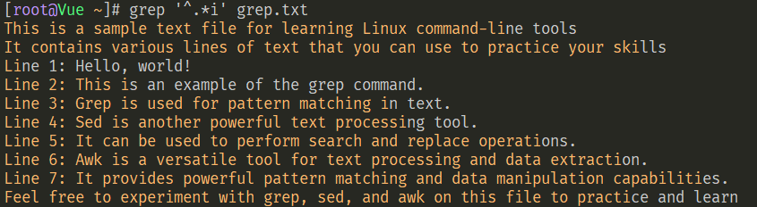

# 1.基础——特殊符号
## 1.1引号系列⭐⭐⭐⭐⭐

| 引号  | 含义                         |
| --- | -------------------------- |
| 单引号 | 所见即所得，引号内的东西原封不动输出         |
| 双引号 | 与单引号类似，对双引号内的特殊符号会进行解析     |
| 无引号 | 和双引号类似，额外支持通配符*.log{1..10} |
| 反引号 | 优先执行反引号内的`命令`              |
```shell
[root@ftp ~]# echo 'WOW `whoami` $(pwd) {a..e}'
WOW `whoami` $(pwd) {a..e}
[root@ftp ~]# echo "WOW `whoami` $(pwd) {a..e}"
WOW root /root {a..e}
[root@ftp ~]# echo WOW `whoami` $(pwd) {a..e}
WOW root /root a b c d e
```

## 1.2重定向符号[[rsync全网备份项目]]
### 输出重定向 >
一个 > 表示将内容输入到文件，两个 >> 表示将内容追加到文件末尾
>`>` 与 `>>` 的前面均省略了`1`
>
>`2>`或`2>>`表示将错误信息添加到文件内
```shell
[root@ftp ~]# echo {1..6} > hello.txt
[root@ftp ~]# cat hello.txt
1 2 3 4 5 6
[root@ftp ~]# echo {1..6} > hello.txt
[root@ftp ~]# echo {1..6} > hello.txt
[root@ftp ~]# cat hello.txt
1 2 3 4 5 6
[root@ftp ~]# echo {1..6} >> hello.txt
[root@ftp ~]# cat hello.txt
1 2 3 4 5 6
1 2 3 4 5 6
[root@ftp ~]# echo {1..6} >> hello.txt
[root@ftp ~]# cat hello.txt
1 2 3 4 5 6
1 2 3 4 5 6
1 2 3 4 5 6
[root@ftp ~]# eco {1..2} > hello.txt
-bash: eco: command not found
[root@ftp ~]# cat hello.txt
[root@ftp ~]# eco {1..2} 2> hello.txt
[root@ftp ~]# cat hello.txt
-bash: eco: command not found
[root@ftp ~]# eco {1..2} 2>> hello.txt
[root@ftp ~]# eco {1..2} 2>> hello.txt
[root@ftp ~]# cat hello.txt
-bash: eco: command not found
-bash: eco: command not found
-bash: eco: command not found
```
**日常用途**：将错误信息和正确的信息都输出到文件，脚本常用
>使用符号`2>&1`或者`&>`，如果需要追加，则将`>`换成`>>`
```shell
# 最常用写法
[root@ftp ~]# eco 123  > hello.txt 2>&1
[root@ftp ~]# cat hello.txt
-bash: eco: command not found

# 最简写法
[root@ftp ~]# echo 123  &> hello.txt
```

### 输入重定向 <
因为有些命令无法寻找输入文件，因此需要重定向输入符号来帮助命令获取输入
```shell
[root@ftp ~]# echo {1..10} > hello.txt
[root@ftp ~]# cat hello.txt
1 2 3 4 5 6 7 8 9 10

# 命令xargs的数据源指向hello.txt
[root@ftp ~]# xargs -n3 < hello.txt
1 2 3
4 5 6
7 8 9
10
[root@ftp ~]# cat hello.txt
1 2 3 4 5 6 7 8 9 10
```
>`xargs -n3` 表示分3组

### 追加输出重定向
用途：多数用于配合`cat`命令实现写入多行内容
```shell
格式：cat >文件<<结束标记

结束标记
# 结束标记常用的是EOF，也可自定义
[root@ftp ~]# cat >wow.txt<<EOF
> wow1
> wow2
> wow3
> EOF
[root@ftp ~]# cat wow.txt
wow1
wow2
wow3

# 另一种写法
格式：cat  <<结束标记 >文件

结束标记
[root@ftp ~]# cat <<EOF > a.txt
> 1
> 2
> 3
> EOF
[root@ftp ~]# cat a.txt
1
2
3
```

## 1.3通配符

>用于给Linux中大部分命令使用，用于批量找文件名（找文件）

| 符号      | 含义                          |
| ------- | --------------------------- |
| `*`     | 表示所有，如*.txt，*.py            |
| `{}`    | 输出序列，与`touch mkdir echo` 配合 |
| []      | 参考正则中的含义                    |
| [!] [^] | 取反                          |
| ？       | 任意一个字符                      |
使用通配符备份文件`cp wow.txt{,.backup}`
```shell
[root@ftp ~]# cp wow.txt{,.backup}
[root@ftp ~]# ll
total 20K
-rw-r--r--  1 root root   15 May 24 20:41 wow.txt
-rw-r--r--  1 root root   15 May 24 20:59 wow.txt.backup
```

# 2.正则
## 正则分类
- [基础正则⭐⭐⭐⭐⭐](#基础正则⭐⭐⭐⭐⭐)：`^  $  ^$  .  *  .*  []  [^]`
- [扩展正则](#扩展正则)：`|  +  ()  {}  ?`

## 基础正则⭐⭐⭐⭐⭐
### 1. `^` 以... ...开头的行⭐⭐⭐⭐⭐
```shell
[root@Vue ~]# cat grep.txt
This is a sample text file for learning Linux command-line tools.
It contains various lines of text that you can use to practice your skills.

Line 1: Hello, world!
Line 2: This is an example of the grep command.
Line 3: Grep is used for pattern matching in text.
Line 4: Sed is another powerful text processing tool.
Line 5: It can be used to perform search and replace operations.
Line 6: Awk is a versatile tool for text processing and data extraction.
Line 7: It provides powerful pattern matching and data manipulation capabilities.

Feel free to experiment with grep, sed, and awk on this file to practice and learn.

# 找出以 Line 开头的行
[root@Vue ~]# grep '^Line' grep.txt
Line 1: Hello, world!
Line 2: This is an example of the grep command.
Line 3: Grep is used for pattern matching in text.
Line 4: Sed is another powerful text processing tool.
Line 5: It can be used to perform search and replace operations.
Line 6: Awk is a versatile tool for text processing and data extraction.
Line 7: It provides powerful pattern matching and data manipulation capabilities.
```
### 2. `$` 以... ...结尾的行⭐⭐⭐⭐⭐
```shell
# 找出以 operations. 结尾的行
[root@Vue ~]# grep 'operations.$' grep.txt
Line 5: It can be used to perform search and replace operations.
```
>如果一行的末尾有隐藏字符，如：空格。则搜索不到
>
>可以使用`cat -A`查看文件的隐藏字符
```shell
[root@Vue ~]# cat -A grep.txt
This is a sample text file for learning Linux command-line tools   $
It contains various lines of text that you can use to practice your skills$
[root@Vue ~]# grep 's$' grep.txt
It contains various lines of text that you can use to practice your skills
[root@Vue ~]# grep 's   $' grep.txt
This is a sample text file for learning Linux command-line tools
```
### 3. `^$` 空行，表示这一行没有任何字符⭐⭐⭐⭐⭐

找出文件中的空行
```shell
[root@Vue ~]# grep '^$' grep.txt


[root@Vue ~]# grep -n '^$' grep.txt
3:
11:
```
排除文件中的空行
>`grep -v:-v, --invert-match   select non-matching lines` 表示取反
```shell
[root@Vue ~]# grep -v '^$' grep.txt
This is a sample text file for learning Linux command-line tools
It contains various lines of text that you can use to practice your skills
Line 1: Hello, world!
```

**实用案例：排除配置文件的空行，并且去掉`#`开头的行**⭐⭐⭐⭐⭐
```shell
[root@Vue ~]# grep -v '^$' /etc/ssh/sshd_config | grep -v '^#'
Include /etc/ssh/sshd_config.d/*.conf
AuthorizedKeysFile      .ssh/authorized_keys
Subsystem       sftp    /usr/libexec/openssh/sftp-server
UseDNS no
AddressFamily inet
SyslogFacility AUTHPRIV
PermitRootLogin yes
PasswordAuthentication no
```
### 4. `.` 任意一个字符，但不匹配空行
```shell
# 匹配任意字符的结尾
[root@Vue ~]# grep '.$' grep.txt
This is a sample text file for learning Linux command-line tools
It contains various lines of text that you can use to practice your skills
Line 1: Hello, world!
```
>如果需要匹配以 `.` 结尾的行，需要使用转义字符 `\`
```shell
[root@Vue ~]# grep '\.$' grep.txt
Line 2: This is an example of the grep command.
```
### 5. `\` 转义字符，用于去掉特殊字符的含义⭐⭐⭐
### 6. `*` 前一个字符连续出现0次或0次以上
### 7. `.*` 所有，任何字符⭐⭐⭐⭐⭐

>使用频率较高的字符组合，相当于一个填充物
```shell
# 找出包含 hello 的行
[root@Vue ~]# grep '^.*Hello' grep.txt
Line 1: Hello, world!
# 找出以 Line 开头，并且包含world的行
[root@Vue ~]# grep -o '^Line.*world' grep.txt
Line 1: Hello, world
```


> 正则的贪婪性：当一行中同时有多个比配项，以最后一个出现的为结尾

### 8. `[]` 表示匹配里面的任意一个字符, []会去掉符号的特殊含义
- 匹配`[abc]`中任意一个
```shell
[root@Vue ~]# grep '[abc]' grep.txt```
```

- 匹配所有小写字母

>`[a-z]`

- 匹配所有大写字母

>`[A-Z]`
- 匹配所有字母

>通用写法`[a-zA-Z]`
>
>非通用写法`[a-Z]`，`grep`适用
- 匹配所有数字

>`[0-9]`
- 匹配所有数字、大小写字母

>通用写法`[a-zA-Z0-9]`
>
>非通用写法`[0-Z]`    `grep`适用

### 9. `[^]` 表示排除里面的任意一个字符


排除a-f

### 基础正则小结⭐⭐⭐⭐⭐

| 基础正则    | 含义            |
| ------- | ------------- |
| ^⭐⭐⭐⭐⭐  | 以XXX开头        |
| $⭐⭐⭐⭐⭐  | 以XXX结尾        |
| ^$⭐⭐⭐⭐⭐ | 空行            |
| .       | 任意一个字符        |
| \       | 转义字符          |
| *       |               |
| .*⭐⭐⭐⭐⭐ | 所有            |
| []⭐⭐⭐⭐⭐ | [abc]，相当于一个字符 |
| `[^]`   | `[^abc]`      |

## 扩展正则

- `grep`使用拓展正则需要`egrep`或者`grep -E`
- `sed`使用`sed -r`
- `awk`默认支持拓展正则，不需要加选项

### 1. `+` 前一个字符连续出现1次或1次以上

>此符号通常配合`[]`使用


>注意：
>

因为每个单词都用空格隔开，单词是连续出现的字母

### 2. `|` 表示或


排除`/etc/ssh/sshd_config`配置文件中的空行以及#
```shell
# 基础正则写法，配合管道
[root@Vue ~]# grep -v '^$' /etc/ssh/sshd_config | grep -v '^#'
# 拓展正则写法
[root@Vue ~]# egrep -v '^$|^#' /etc/ssh/sshd_config
# 另一种做法：找出以字母开头的行，结果与上面的一致
[root@Vue ~]# grep '^[a-Z]' /etc/ssh/sshd_config
```


### 3. ()表示一个整体，用于后向引用（sed反向引用）

^7fa4b4

查看是否安装了vim或者tree或者iotop


另一种做法，将三个软件看成一个整体，用括号括起来


### 4. `{}`，`a{n,m}`表示a连续出现了至少n次最多m次（包括n）

| 格式       | 含义                 | 应用      |
| -------- | ------------------ | ------- |
| `a{n,m}` | 前一个字符连续出现至少n次，最多m次 | 连续出现的范围 |
| `a{n}`   | `前一个字符连续出现n次`      | 匹配固定次数  |
| a{n,}    | 前一个字符连续出现至少n次      |         |
| a{,m}    | 前一个字符连续出现最多m次      |         |

### 5. `?`，前一个字符出现0次或1次

### 拓展正则小结

| 符号      | 含义             |
| ------- | -------------- |
| +⭐⭐⭐⭐⭐  | 前一个字符连续出现1次或多次 |
| \|⭐⭐⭐⭐⭐ | 或              |
| ()⭐⭐    | 整体；配合sed       |
| {}      |                |
| ?       |                |

